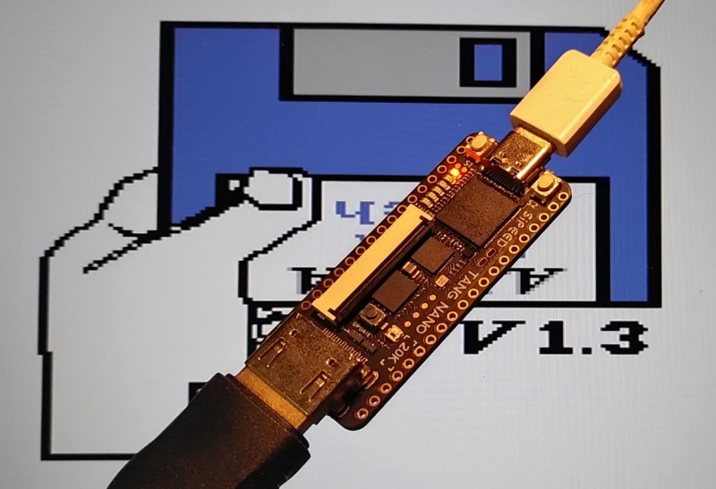

# NanoMig

NanoMig is a port of the [Minimig](https://en.wikipedia.org/wiki/Minimig) Commodore Amiga FPGA implementation to the [Tang Nano 20K](https://wiki.sipeed.com/hardware/en/tang/tang-nano-20k/nano-20k.html), [Tang Primer 25K](https://wiki.sipeed.com/hardware/en/tang/tang-primer-25k/primer-25k.html), [Tang Mega 138K Pro](https://wiki.sipeed.com/hardware/en/tang/tang-mega-138k/mega-138k-pro.html) and [Tang Console with Mega 60k module](https://wiki.sipeed.com/hardware/en/tang/tang-console/mega-console.html) FPGA development boards.




This is based on the [MiSTeryNano project](https://github.com/harbaum/MiSTeryNano/) and also relies on a [FPGA companion](http://github.com/harbaum/FPGA-Companion) to be connected to the FPGA board for USB support and on-screen-display control.

This is still a work in progress. The current version is based on the [MiSTer Minimig AGA code](https://github.com/MiSTer-devel/Minimig-AGA_MiSTer) and runs many Amiga games and demos.

Current state:

  * Minimig based on [MiSTer Minimig AGA](https://github.com/MiSTer-devel/Minimig-AGA_MiSTer)
  * Kick ROM stored in flash ROM
  * Up to 2MB chip and 1.5MB slow RAM
  * OCS and ECS chipset (no AGA!)
  * Up to four virtual floppy drives
  * HDMI video and audio, PAL and NTSC
  * Keyboard, Mouse and Joystick via USB
  * Virtual IDE hard disk read an write support
  * Runs on [Tang Nano 20k](https://wiki.sipeed.com/hardware/en/tang/tang-nano-20k/nano-20k.html), [Primer 25K](https://wiki.sipeed.com/hardware/en/tang/tang-primer-25k/primer-25k.html), [Mega 138K Pro](https://wiki.sipeed.com/hardware/en/tang/tang-mega-138k/mega-138k-pro.html) and [Tang Console with Mega 60k module](https://wiki.sipeed.com/hardware/en/tang/tang-console/mega-console.html)
  * [Fully simulated](sim)

Planned features:
  * Floppy disk write support
  * Accelerated 68020 support (may not fit)
  * AGA support (may not fit)

## Videos

These youtube shorts mainly document the progress:

  * [NanoMig #10: World of Commodore Amiga Demo on Tang Primer 25k](https://youtube.com/shorts/XdLlrg1wgko)
  * [NanoMig #9: Amiga speedball 2 on Tang Mega 138k Pro](https://youtube.com/shorts/NHFjJwGAOZ0)
  * [NanoMig #8: Booting from virtual Harddisk](https://youtube.com/shorts/9LJ0tsSZb60)

<details><summary>More ...</summary>
<ul>
  <li><a href="https://youtube.com/shorts/vbYURdxtEAQ">NanoMig #7: Tiniest Amiga running Gods</a></li>
  <li><a href="https://youtube.com/shorts/uFKjddN-WSA">NanoMig #6: First signs of life with the 68ec020</a></li>
  <li><a href="https://youtube.com/shorts/PSqerpTvJrw">NanoMig #5: Cheap FPGA Amiga finally runs Planet Rocklobster Demo</a></li>
  <li><a href="https://youtube.com/shorts/00sgeovKQa4">NanoMig #4: Running Amiga Pro tracker on the Tang Nano 20k</a></li>
  <li><a href="https://www.youtube.com/shorts/ZvdcHXi-k2g">NanoMig #3: Booting workbench for the first time on Tang Nano 20k</a></li>
  <li><a href="https://www.youtube.com/shorts/5n52x6f5NDI">NanoMig #2: USB keyboard and audio for the FPGA Amiga</a></li>
  <li><a href="https://www.youtube.com/shorts/ti7aLr5Kjqc">NanoMig #1: Amiga DiagROM booting on Tang Nano 20k</a></li>
</ul>
</details>

## What's needed?

The necessary binaries can be found in the [project releases](https://github.com/harbaum/NanoMig/releases).

  * ```nanomig.fs``` needs to be flashed to the FPGA's flash memory
    * ```openFPGALoader -f nanomig.fs```
    * Currently supported are Tang Nano 20k with HDMI (```nanomig.fs```), Tang Nano 20k with RGB LCD (```nanomig_lcd.fs```), Tang Primer 25k (```nanomig_tp25k.fs```), Tang Mega 138k (```nanomig_tm128k.fs```), and Tang Console 60k (```nanomig_tc60k.fs```)
  * On Nano 20k, Primer 25k and Console 60K Kickstart 1.3 ```kick13.rom``` needs to be flashed to offset 0x400000 _and_ 0x440000. On Mega 138K use addresses 0xc00000 and 0xc40000 instead.
    * ```openFPGALoader --external-flash -o 0x400000 kick13.rom```
    * ```openFPGALoader --external-flash -o 0x440000 kick13.rom```
  * For IDE HDD support Kickstart 3.1 ```kick31.rom``` needs to be flashed at offset 0x400000 (Mega: 0xc00000) only
    * ```openFPGALoader --external-flash -o 0x400000 kick31.rom```
  * The [latest FPGA Companion firmware](http://github.com/harbaum/FPGA-Companion) needs to be flashed to the support MCU
    * Currenly supported are [M0S Dock (BL616)](https://github.com/harbaum/FPGA-Companion/tree/main/src/bl616), [Raspberry Pi Pico (RP2040)](https://github.com/harbaum/FPGA-Companion/tree/main/src/rp2040) and [ESP32-S2/S3](https://github.com/harbaum/FPGA-Companion/tree/main/src/esp32) 
  * A default ADF disk image named ```df0.adf``` should be placed on SD card (e.g. workbench 1.3)
  * For the SD card to work [all components incl. the support MCU](https://github.com/harbaum/NanoMig/issues/5) have to work properly
