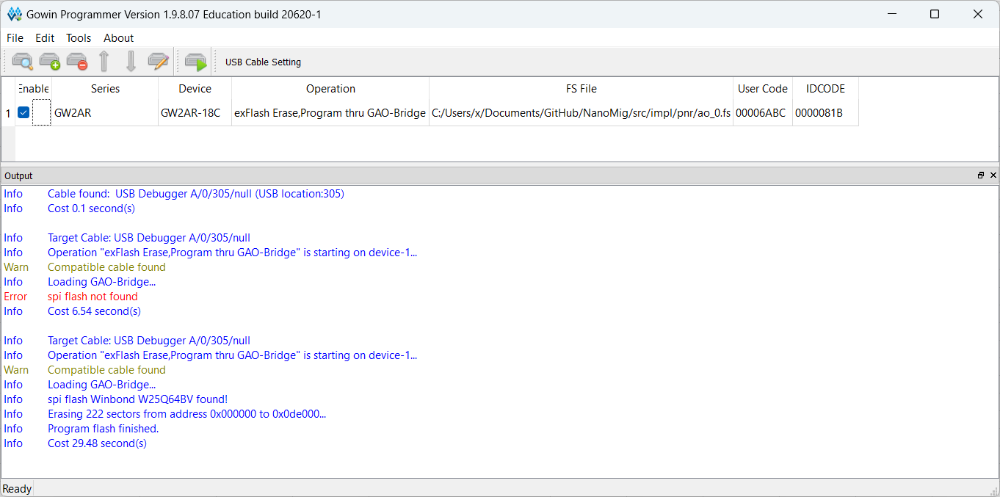

# How to Use GAO (Gowin Analyzer Oscilloscope)

To get started, follow this guide: [Gowin Analyzer Oscilloscope Tutorial](https://www.reddit.com/r/GowinFPGA/wiki/tutorials/gowin_analyzer_oscilloscope/).

## Important Notes

### Downgrading the Programmer (Windows Only)
If you're using Windows, you might need to downgrade the programmer software to version 1.9.8.07. You can download `Programmer_20221019.zip` from [this link](https://dl.sipeed.com/shareURL/TANG/programmer). This is recommended in the [Tang Nano Documentation](https://wiki.sipeed.com/hardware/en/tang/Tang-Nano-Doc/questions.html#Using-GAO).

### Troubleshooting Common Issues

- **Programmer shows 'Error: "spi flash not found"'**  
  If you receive this error message in the output window, click the “Program/Configure” button once again. 1-2 retries is typically sufficient.

- **Black Screen on Namomig with Working OSD**  
  If the screen stays black or displays a uniform color (white, yellow, etc.) while the On-Screen Display (OSD) is working, reflash the Tang Nano. 
If reflashing doesn't solve the issue, try reconfiguring the signals and creating a new `ao_0.fs` file.

### The Programmer Window

