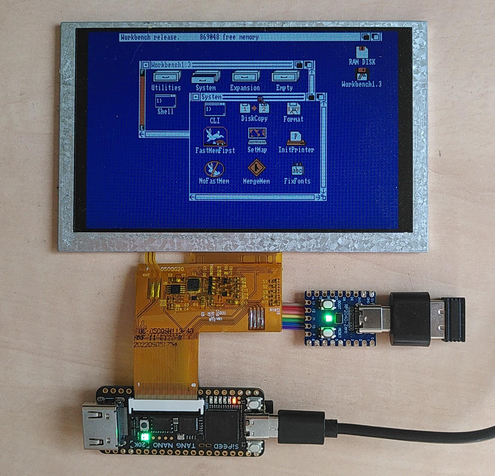
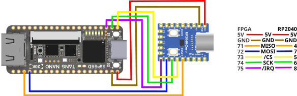

# Tang Nano 20k LCD Setup

Sipeed sells a 5 inch LCD for the Tang Nano 20k. This LCD has a resultion
of 800x480 pixels and attaches directly to the Tang Nano 20k without using the
HDMI connector. This is supported by the Atari ST and Amiga cores. The
Tang Nano 20k additionally comes with a built-in audio amplifier which comes
in handy in this setup to add sound output.



The LCDs vertical resolution of 480 pixels nicely matches the scandoubled
verical resolution of the Atari ST's 200 lines and leaves some space for
the borders. Also the Amigas NTSC mode with 200 lines (400 interlaced) works
nicely. In PAL mode the Amiga can display 512 lies which cannot be displayed
to full extent on this LCD. This is only a minor issue as many CRTs back in the
days would also no be able to display all lines and most software accomodates
for that by using the bottom lines only for "less important" content.

# Hardware setup

All variants of the [FPGA
Companion](https://github.com/harbaum/FPGA-Companion) can be used with
the LCD setup as well. These instructions use the [Waveshare
RP2040-Zero variant](https://www.waveshare.com/wiki/RP2040-Zero) as it
provides a nice and compact solution. The Tang Nano 20k and the RP2040-Zero
need to be wired up in the folloring way:



The LCD setup uses different pins on the FPGA to connect to the FPGA Companion
than the regular version. This is due to the fact that the LCD uses most of the
FPGAs spare connections incl. those that normally would be used for the FPGA
Companion. The signals thus had to be moved to FPGA pins neither used by the LCD
nor by the audio amplifier.

The signal pins used in this case are:

| FPGA | RP2040 | Signal | Description |
|---|---|---|---|
| | GP0  | UART_TX  | Serial debug output |
| 71 | GP4 | MISO | SPI data from FPGA |
| 73 | GP5 | CSn | SPI chip select to FPGA |
| 74 | GP6 | SCK | SPI clock to FPGA |
| 72 | GP7 | MOSI | SPI data to FPGA |
| 75 | GP8 | IRQn | SPI interrupt from FPGA |

# Installation

1. Install two copies of kickstart 1.3 ROM in the FPGAs flash
    * ```openFPGALoader --external-flash -o 0x400000 kick13.rom```
    * ```openFPGALoader --external-flash -o 0x440000 kick13.rom```
2. Install [the core](https://github.com/harbaum/NanoMig/releases/) in the FPGAs flash
   * ```openFPGALoader -fs nanomig_lcd.fs```

If the LCD is connected the Tang Nano 20k should boot up to the Kickstart
floppy disk/hand screen. This should even work without SD card inserted and
without FPGA Companion connected.

Then install the [RP2040-Zero variant of the FPGA Companion
firmware](https://github.com/harbaum/FPGA-Companion/releases) on the
RP2040-Zero. The RGB LED on the RP2040-Zero should blink green and the
RGB LED on the Tang Nano should also light up first blue, then red (if no
sd card has been inserted, yet) or green.

Finally a FAT formatted SD card should be inserted into the Tang Nano 20k
and the keyboard and/or mouse connected to the USB-C port of the RP2040-Zero
using a USB-C to USB-A adapter.
