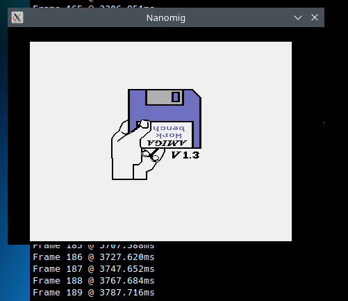
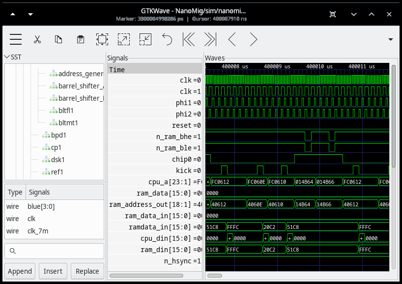

# NanoMig simulation

The fact that the entire Minimig and the fx68k CPU core are written in
verilog allows them to be run in a verilator simulation on a Linux PC.

Currently implemented in this testbench are:

 - Run the complete Minimig and fx68k core on a real kickstart 1.3
 - Video output via SDL
 - Floppy disk emulation
 - SD card emulation
 - UART emulation (for e.g. diagnostic output of DiagROM)

Some of these features can be enabled and disabled in the ```Makefile```
and in ```nanomig.cpp``` itself. Not all options are always tested and
some changes in the HDL core may be broken some tests. By default
the simulation is configured for video emulation in endless
operation. This means that running the simulation will not output
any wave data but will instead just run with emulated video. Using
a kickstart 1.3 ROM this will e.g. display the disk/hand screen after
having simulated 187 frames.



The [original fx68k core](https://github.com/ijor/fx68k) does not
work in verilator. This simulation thus includes a [variant
that runs on verilator](https://github.com/emoon/fx68x_verilator).

## Building and running

The simulation has only been tested on Linux.

It has been tested with Verilator 5.015 devel rev v5.014-19-g768b78e7d
built from the [github master branch in early
2024](https://github.com/verilator/verilator). Earlier versions,
especially the ones that come with some Linux distros are likely too
old. Newer versions will probably work. You'll need to adjust the
[Makefile](Makefile#L27) to point to your installed verilator setup.

For video simulation ```libsdl2``` is needed.

### Additional files needed

At least a kickstart 1.3 ROM named ```kick13.rom``` is needed to run
the simulation. Other ROMs like
[DiagROM](https://github.com/ChuckyGang/DiagROM) may also work
although the video simulation is far from being complete and e.g. the
video output of DiagROM is broken. However, UART output can be enabled
allowing to see the initial diagnostic output of DiagROM.

Further simulation features like e.g. floppy simulation may
need addtional files like e.g. ADF disk images. See the
[```nanomig.cpp```](nanomig.cpp) for details.

With all dependencies in place a simple ```make run``` should build
the simulatior and run it.

## Running traces

Tracing can be enabled in [```nanomig.cpp```](nanomig.cpp#L53) by
setting the following lines like e.g.:

```
#define TRACESTART   0.4
#define TRACEEND     (TRACESTART + 0.2)   // 0.1s ~ 1G
```

This will start writing out a trace file after 0.4 seconds of simulated run
time and it will write a trace for 0.2 seconds of runtime. The traces
will be ~1 GBytes per 100ms simulated runtime.

The resulting VCD trace can e.g. be loaded into
[gtkwave](https://gtkwave.sourceforge.net/) for further inspection.



## Screenshots

With video emulation enabled all frames are written to the
[screenshots](screenshots) directory in raw rgb data. These can be
converted to e.g. png using [```ffmpeg```](https://www.ffmpeg.org/) like so:

```
ffmpeg -vcodec rawvideo -f rawvideo -pix_fmt abgr -s 456x313 frame000.raw $1 -f image2 -vcodec png frame000.png
```
