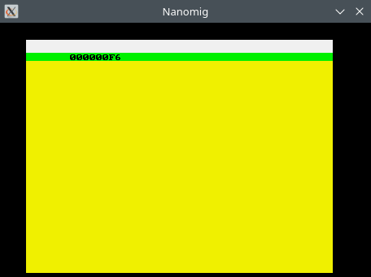

# NanoMig test rom

This is a skeleton for a custom test rom to test the NanoMig in
simulation (and potentially on FPGA as well).

It is translated using
[vasm68k](https://github.com/StarWolf3000/vasm-mirror). Which needs to
be built for the m68k cpu:

```
make CPU=m68k SYNTAX=mot
```

The resulting ```vasmm68k_mot``` can be used to assemble the
source code:

```
$ ./vasmm68k_mot -Fbin test_rom.s -o test_rom.bin
vasm 1.9f (c) in 2002-2023 Volker Barthelmann
vasm M68k/CPU32/ColdFire cpu backend 2.6c (c) 2002-2023 Frank Wille
vasm motorola syntax module 3.18 (c) 2002-2023 Frank Wille
vasm binary output module 2.3a (c) 2002-2023 Volker Barthelmann and Frank Wille

org0001:f80000(acrwx2):           12 bytes
org0002:f80030(acrwx2):          442 bytes
```

The resulting ```test_rom.bin``` can then be specified in
[nanomig.cpp](../nanomig.cpp#L23) as the ```KICK``` file to boot
which will then run in the simulation.


